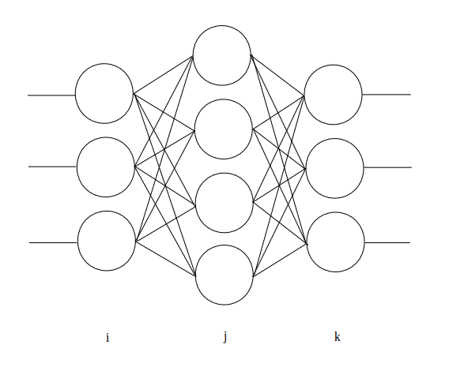

================
Back Propagation
================

:題名: Deep Learning(Neural Network)における Back propagation(逆伝搬)の解説
:著者: 柏木 明博
:作成日: 2017年6月20日

複数の層を超える誤差の伝搬方法
==============================

.. figure:: neuron_model.png
	:alt: 神経細胞とモデル
	:align: center

	図1.神経細胞とモデル

Forward Propagation(順伝搬)では、入力層から出力層に向かって、値と荷重の総和
を伝搬して行き、出力層で結果を得るものでしたが、それはその時の結合荷重による
ものでした。Deep Learing(Neural Network)では、学習と言う段階を経て、入力値に
対応した出力値を憶えさせます。つまり、入力値に対応した出力値が得られるように、
結合荷重を調整します。Neural Networkは、生物の神経細胞を模倣したものですから、
結合荷重の調整方法も生物から模倣したいところですが、現在のところ生物がどのよ
うに結合荷重を調整しているのか、正確なところは判明していません。Neural Netwo
rkが発見された初期の頃、パーセプトロンと言うモデルが利用されました。これは、
入力値をForward Propagation(順伝搬)を用いて計算し、得られた結果と、正しい答え
を比較し、その差分を結合荷重に反映するものです。つまり、正しい答えとの誤差が
なくなるように結合荷重を調整して行きます。具体的には、下記のようになります。

.. math::
	:label: パーセプトロンの学習方法

	w = w + \eta ( t - z ) \cdot z

	\eta:学習率

	t:教師信号

	z:出力値

	w:結合荷重　

意外に素直な理解が得られるのではないでしょうか。正しい答えと、間違った答えを
比較して、その誤差を結合荷重に加えて行きます。この方法でも十分有用な利用が可
能ですが、いくつか問題点も見つかっています。それは、線形な情報にしか対応でき
ないことと、誤差を複数の層へ伝えられない事です。線形な情報とは、直線でしか分
離できない情報のことですが、定規で真っ直ぐな線を引いて分離できる情報です。曲
線を使わないと分離できないような、複雑な情報は正確に対応できません。また、誤
差を複数の層へ伝えられないとは、上記(1)の式のように誤差は、正しい答えとの差分
ですから、出力層に置いては正しい答えと現在の出力値を比較することができますが、
出力層以外の中間層や入力層では、比較ができません。これは、実際の生物の神経細
胞においても未だ解明されていない仕組みです。しかし、生物の神経細胞も確かに多
層構造となっており、何らかの伝達物質あるいは、伝達方法があるはずだと言われて
います。実際、その伝達物質や伝達方法が見つかった、と言うニュースが時々流れて
いますが、確証されてはいないようです。

	図2. 三層 Neural Network

そこで考案されたのが、確率的勾配降下法によるBackpropagation(誤差逆伝搬)です。
Backpropagationは、今、盛んに利用されているConvolutional Neural Networkの出
力層にも利用されている計算方法です。Backpropagationが分かると、CNNの残りの計
算は、簡単に理解できるはずです。確率的勾配降下法では、上記パーセプトロンによ
る学習方法と同じように正しい答えとの誤差を用いて結合荷重を更新して行きますが、
更新には誤差に対する結合荷重による微分値、つまり一階微分ですから、傾きを用い
て更新して行きます。傾きがプラス方向の場合は、結合荷重をマイナス方向へ、傾き
がマイナス方向の場合は、結合荷重をプラス方向へ更新します。式は、パーセプトロ
ンの学習方法と基本的な考え方は変わっておらず、これまでの言葉による説明を式に
すると、下記のようになります。

.. math::
	:label: 確率的勾配降下法による学習方法

	w = w + ( -\epsilon \Delta E )

	\epsilon:学習率

	E:誤差値

	w:結合荷重

..  	E:誤差値　・・・　\frac{ \sum ( t - z )^2 }{ 2 }

.. 誤差値Eは、式(2)の通り二乗誤差を用いますが、Eを結合荷重wで微分した :math:`\Delta E`
.. を求めると、消えてしまいます。式(3)
..
.. .. math::
.. 	:label: 誤差Eの結合荷重wによる微分dE
..
.. 	\Delta E = \frac{ \partial E }{ \partial w } = ( y - t ) \cdot z
..
.. 	y = w \cdot z
..
.. 	z:前層出力
..
.. 	w:結合荷重　

そして、この結合荷重の更新を出力層から、入力層に向かって遡ってゆくことから
Backpropagation(誤差逆伝搬)と呼ばれます。誤差値はEで表しましたが、遡る誤差は、
誤差信号 :math:`\delta` と表し、以下のように計算します。

.. math::
	:label: 誤差信号d

	\delta_{j} = \sum_{k=1}^{N} \left \{ ( w_{jk} \cdot {\delta}_{k} ) \cdot f'(z_{j}) \right \}

	f'(z_{j}) = \{ 1 - f( z_{j} ) \} \cdot f(z_{j})

	f:シグモイド関数

	f':微分したシグモイド関数

	{\delta}_{j}:誤差信号（入力層側）

	{\delta}_{k}:誤差信号（出力層側）

	z_{j}:前層出力（入力層側）

	w_{jk}:結合荷重　

	N:出力層側のユニット数

:math:`f'` は、前の項目「Forward Propagation」で解説しているシグモイド関数を
微分したものです。出力層の :math:`\delta_{k}` だけは下記の式によって得ます。
:math:`\delta_{j}` より入力層側の :math:`\delta` （図2は三層の為、:math:`\delta_{i}` 
から入力層側は使用しません）は、式(3)によって計算します。

.. math::
	:label: 出力層の誤差信号d

	\delta_{k} = ( z_{k} - t )

	z_{k}:出力層出力

	t:教師信号

この :math:`\delta_{k}` から初めて、中間層の出力層側から順番に入力層側へ :math:`\delta`
を計算して行きます。具体的なコードで表すと、以下のようになります。LIST 1,2,3,4は、
引数や変数の宣言などの計算に付随する処理ですが、LIST 5が誤差信号 :math:`\delta` の
処理になります。

GPUによる誤差信号 :math:`\delta` の処理
=======================================

ここでは、nVIDIA GPU用の CUDA C を用いて確率的勾配降下法によるBack
propagation(誤差逆伝搬)を行う実際のソースコードを示します。

LIST 1. 引数取得

.. code-block:: c

	__global__ void calc_delta(
					// target phase
		long trg,
					// pointer of data memory
		void *mem
	){

LIST 2. 変数宣言

.. code-block:: c

	int tid;
					// thread id
	long k_cnt;
					// counter of output side
	long j_cnt;
					// counter of input side
	double ff;
					// number of differential s
	double sum;
					// number of summary
	NEURON_T *n;
					// pointer of neuron
	long kphase;
					// number of output side phase
	long jphase;
					// number of input side phase
        long unitk;
                                        // number of unit k
        long unitj;
                                        // number of unit j
	long j;
					// number of j

LIST 3. GPUに関連した処理

.. code-block:: c

					// set neuron instance
	n = (NEURON_T *)mem;
					// set phase number
	jphase = trg + 0;
	kphase = trg + 1;
					// set a number of unit
	unitj = n->z_num[jphase];
	unitk = n->z_num[kphase];

	tid = blockIdx.x;
	if(tid > unitj - 1 || tid < 0){
					// check for enable threads
		return;
	}

nVIDIA GPU CUDA Cにおける定形処理のようなものですが、実際に実行される
threadは、j層ユニットごとに一つとなる為、CUDAが呼び出したthreadが
j層ユニットに対応していない場合は、何もせずに処理を返します。また、その
j層ユニットの数をメモリ領域から取り出すための処理も付随しています。CUDA
Cの詳細は、リファレンス等をご参照願います。

LIST 4. 直線的なメモリ領域から、jの位置を求める関数

.. code-block:: c

	__device__ __host__ long calcj( long j, long jmax, long k ){

		return j + (jmax * k);
	}

こちらも前の項目「汎用GPUにおける結合荷重及び関連値の保持」で述べてい
る通り、二次元配列であるw(i,j)を直線的な一次元配列へ格納している為、一
次元配列から二次元配列への変換を行っています。

LIST 5. :math:`\delta` の計算

.. code-block:: c

					// set block id
		j_cnt = blockIdx.x;

		if(j_cnt < unitj){
					// calculate forward
			sum = 0;

			ff = differented_sigmoid( n->z[jphase][j_cnt] );

			for( k_cnt = 0; k_cnt < unitk; k_cnt++ ){

				j = calcj( j_cnt, unitj, k_cnt );

				sum += n->w[kphase][j] * n->d[kphase][k_cnt] * ff;
			}

			n->d[jphase][j_cnt] = sum;

			n->db[jphase][j_cnt]
				= n->db[jphase][j_cnt] * n->b[jphase][j_cnt] * ff;
		}
					// Normal return
		return;

LIST 6. シグモイド関数とその微分関数

.. code-block:: c

	__device__ double sigmoid( double x ){

		return 1 / (1 + exp( -1 * x * SIGMOID_ALPHA ));
	}

	__device__ double differented_sigmoid( double x ){

	        return sigmoid( x ) * ( 1 - sigmoid( x ) );
	}

計算方法は先述の通りですが、構造体要素に付いている配列添え字は、例えば
n->z[jphase][j_cnt] の場合、jphase層のj_cntユニットのz値を表しています。
n->dbは、バイアス :math:`b` の誤差信号 :math:`\delta` です。計算方法は
同じで、各ユニットに一つずつしか無いため、総和は取りません。同様に、 出
力層における :math:`\delta_{k}` の計算処理の具体的なコードは、以下のよ
うになります。

GPUによる出力層 :math:`\delta` の処理
=====================================

LIST 7.引数取得

.. code-block:: c

	__global__ void calc_delta_at_out(
					// target phase
		long trg,
					// pointer of data memory
		void *mem,
					// teach data
		double *teach,
					// length of teach data
		long teach_num
	){

LIST 8.変数宣言

.. code-block:: c

	int tid;
					// thread id
	long j_cnt;
					// counter of output side
	NEURON_T *n;
					// Neuron structure
	long jphase;
					// number of output phase
	long unitj;

LIST 9.GPUに関連した処理

.. code-block:: c

	n = (NEURON_T *)mem;
					// set neuron instance
	jphase = trg + 1;
					// set a phase number
	unitj = n->z_num[jphase];
					// set a number of unit
	tid = blockIdx.x;
	if(tid > unitj - 1 || tid < 0){
					// check for enable threads
		return;
	}

LIST 10. 出力層における :math:`\delta` の計算

.. code-block:: c

					// set block id
		j_cnt = blockIdx.x;

		if(j_cnt < unitj){
					// calculate forward
			n->d[jphase][j_cnt]
				= sigmoid(n->z[jphase][j_cnt])
				- teach[(unitj * teach_num) + j_cnt];

			n->db[jphase][j_cnt] = n->d[jphase][j_cnt];
		}
					// Normal return
		return;

プログラムの構造は、前述の中間層における :math:`\delta` と同じです。
引数に教師信号teachとその数teach_numを受け取っています。こうして計
算した各層の :math:`\delta` と式(2)を用いて、各層の結合荷重 :math:`w` 
を更新します。

GPUによる結合荷重 :math:`w` の更新処理
======================================

LIST 11.引数取得

.. code-block:: c

	__global__ void calc_delta_w(
					// target phase
		long trg,
					// pointer of data memory
		void *mem
	){

LIST 12.変数宣言

.. code-block:: c

	int tid;
					// thread id
	long i_cnt;
					// counter of input side
	long j_cnt;
					// counter of output side
	NEURON_T *n;
					// neuron structure
	double *zi;
					// Pointer of d at j side
	double *dj;
					// Pointer of b at j side
	double *bj;
					// Pointer of db at j side
	double *dbj;
					// pointer of  input side z
	long iphase;
					// number of input phase
	long jphase;
					// number of output phase
	long uniti;
					// Number of unit i
	long unitj;
					// Number of unit j
	double ETA;
					// Number of learning rate

LIST 13.GPUに関連した処理

.. code-block:: c

					// Set neuron instance
	n = (NEURON_T *)mem;
					// Set phase number for i and j
	iphase = trg + 0;
	jphase = trg + 1;
					// Get a phase number
	uniti = n->z_num[iphase];
	unitj = n->z_num[jphase];

	tid = blockIdx.x;
					// Set block ID

	if(tid > unitj - 1 || tid < 0){
					// check for enable threads
		return;
	}

LIST 14. :math:`\delta` による :math:`w` の更新

.. code-block:: c

					// Set learning rate
		ETA = 0.1;
					// set z pointer
		 zi = n->z[iphase];
		 dj = n->d[jphase];
		 bj = n->b[jphase];
		dbj = n->db[jphase];
					// set block id
		j_cnt = blockIdx.x;

		if(j_cnt < unitj){
					// calculate w

			for( i_cnt = 0; i_cnt < uniti; i_cnt++ ){

				n->w[jphase][i_cnt + (uniti * j_cnt)]
					-= ( dj[j_cnt] * sigmoid(zi[i_cnt]) ) * ETA;
			}

			bj[j_cnt] -= dbj[j_cnt] * ETA;

		}
					// Normal terminate
		return;

前述の式(2)の通りに :math:`w` を更新しています。ziに関しては、前段階の処
理であるForward Propagationの都合で、活性化関数（シグモイド関数）を通した
値を :math:`z` にセットしていないため、イレギュラー的にここでsigmoid()を
挟んでいます。一般的にこの部分では、活性化関数を用いませんが、今回のプロ
グラムでは、 :math:`z` を使用する段階で活性化関数を通すような処理となって
います。

