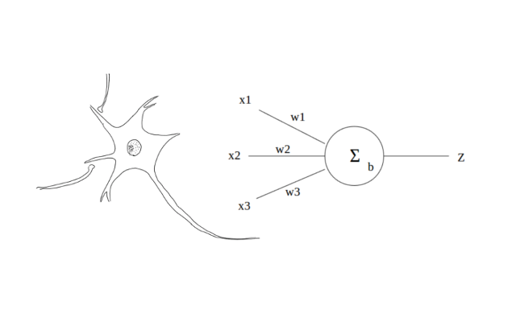
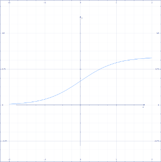

================
Back Propagation
================

:題名: Deep Learning(Neural Network)における Back propagation(逆伝搬)の解説
:著者: 柏木 明博
:作成日: 2017年6月20日

複数の層を超える誤差の伝搬方法
==============================

Forward Propagation(順伝搬)では、入力層から出力層に向かって、値と荷重の総和
を伝搬して行き、出力層で結果を得るものでしたが、それはその時の結合荷重による
ものでした。Deep Learing(Neural Network)では、学習と言う段階を経て、入力値に
対応した出力値を憶えさせます。つまり、入力値に対応した出力値が得られるように、
結合荷重を調整します。Neural Networkは、生物の神経細胞を模倣したものですから、
結合荷重の調整方法も生物から模倣したいところですが、現在のところ生物がどのよ
うに結合荷重を調整しているのか、正確なところは判明していません。Neural Netwo
rkが発見された初期の頃、パーセプトロンと言うモデルが利用されました。これは、
入力値をForward Propagation(順伝搬)を用いて計算し、得られた結果と、正しい答え
を比較し、その差分を結合荷重に反映するものです。つまり、正しい答えとの誤差が
なくなるように結合荷重を調整して行きます。具体的には、下記のようになります。

.. math::
	:label: パーセプトロンの学習方法

	w = w + \eta ( t - z ) \cdot z

	\eta:学習率

	t:教師信号

	z:出力値

	w:結合荷重　

意外に素直な理解が得られるのではないでしょうか。正しい答えと、間違った答えを
比較して、その誤差を結合荷重に加えて行きます。この方法でも十分有用な利用が可
能ですが、いくつか問題点も見つかっています。それは、線形な情報にしか対応でき
ないことと、誤差を複数の層へ伝えられない事です。線形な情報とは、直線でしか分
離できない情報のことですが、定規で真っ直ぐな線を引いて分離できる情報です。曲
線を使わないと分離できないような、複雑な情報は正確に対応できません。また、誤
差を複数の層へ伝えられないとは、上記(1)の式のように誤差は、正しい答えとの差分
ですから、出力層に置いては正しい答えと現在の出力値を比較することができますが、
出力層以外の中間層や入力層では、比較ができません。これは、実際の生物の神経細
胞においても未だ解明されていない仕組みです。しかし、生物の神経細胞も確かに多
層構造となっており、何らかの伝達物質あるいは、伝達方法があるはずだと言われて
います。実際、その伝達物質や伝達方法が見つかった、と言うニュースが時々流れて
いますが、確証されてはいないようです。

そこで考案されたのが、確率的勾配降下法によるBackpropagation(誤差逆伝搬)です。
確率的勾配降下法では、上記パーセプトロンによる学習方法と同じように正しい答え
との誤差を用いて結合荷重を更新して行きますが、更新には誤差に対する結合荷重に
よる微分値、つまり一階微分ですから、傾きを用いて更新して行きます。傾きがプラ
ス方向の場合は、結合荷重をマイナス方向へ、傾きがマイナス方向の場合は、結合荷
重をプラス方向へ更新します。式は、パーセプトロンの学習方法と基本的な考え方は
変わっておらず、これまでの言葉による説明を式にすると、下記のようになります。

.. math::
	:label: 確率的勾配降下法による学習方法

	w = w + ( -\epsilon \Delta E )

	\epsilon:学習率

	E:誤差値

	z:前層出力

	w:結合荷重　

..  	E:誤差値　・・・　\frac{ \sum ( t - z )^2 }{ 2 }

.. 誤差値Eは、式(2)の通り二乗誤差を用いますが、Eを結合荷重wで微分した :math:`\Delta E`
.. を求めると、消えてしまいます。式(3)
.. 
.. .. math::
.. 	:label: 誤差Eの結合荷重wによる微分dE
.. 
.. 	\Delta E = \frac{ \partial E }{ \partial w } = ( y - t ) \cdot z
.. 
.. 	y = w \cdot z
.. 
.. 	z:前層出力
.. 
.. 	w:結合荷重　

そして、この結合荷重の更新を出力層から、入力層に向かって遡ってゆくことから
Backpropagation(誤差逆伝搬)と呼ばれます。誤差値はEで表しましたが、遡る誤差は、
誤差信号 :math:`\delta` と表し、以下のように計算します。

.. math::
	:label: 誤差信号d

	\delta = ( w \cdot {\delta}_{k} ) \cdot f'(z)

	f'(z) = \{ 1 - f( z ) \} \cdot f(z)

	f:シグモイド関数

	f':微分したシグモイド関数

	{\delta}_{k}:誤差信号（出力層側）

	z:前層出力（入力層側）

	w:結合荷重　

:math:`f'` は、前の項目「Forward Propagation」で解説しているシグモイド関数を
微分したものです。出力層の :math:`\delta` だけは下記の式によって得ます。

.. math::
	:label: 出力層の誤差信号d

	\delta = ( z - t )

	z:出力層出力

	t:教師信号

この :math:`\delta` から初めて、中間層(出力層側)から順番に入力層側へ :math:`\delta` 
を計算して行きます。具体的なコードで表すと、以下のようになります。

LIST 1. 引数取得

.. code-block:: c

	__global__ void calc_delta(
		long trg,
		long unitk,
		long unitj,
		long l_num,
		void *mem
	){

LIST 2. 変数宣言

.. code-block:: c

	int tid;
					// thread id
	long k_cnt;
					// counter of output side
	long j_cnt;
					// counter of input side
	double ff;
					// number of differential s
	double sum;
					// number of summary
	NEURON_T *n;
					// pointer of neuron
	long kphase;
					// number of output side phase
	long jphase;
					// number of input side phase
	long j;
					// counter of j phase

LIST 3. GPUに関連した処理

.. code-block:: c

	tid = blockIdx.x;
	if(tid > unitj - 1 || tid < 0){
					// check for enable threads
		return;
	}

nVIDIA GPU CUDA Cにおける定形処理のようなものですが、実際に実行される
threadは、jユニットごとに一つとなる為、CUDAが呼び出したthread番号が
jユニットに対応していないthreadは、何もせずに処理を返します。

LIST 4. 直線的なメモリ領域から、jの位置を求める関数

.. code-block:: c

	__device__ __host__ long calcj( long j, long jmax, long k ){

		return j + (jmax * k);
	}

LIST 5. :math:`\delta` の計算

.. code-block:: c

					// set neuron instance
	n = (NEURON_T *)mem;
					// set phase number
	jphase = trg + 0;
	kphase = trg + 1;
					// set number of unit
	unitj = n->z_num[jphase];
	unitk = n->z_num[kphase];

					// set block id
	j_cnt = blockIdx.x;

	if(j_cnt < unitj){
					// calculate forward
		sum = 0;

		ff = differented_sigmoid( n->z[jphase][j_cnt] );

		for( k_cnt = 0; k_cnt < unitk; k_cnt++ ){

			j = calcj( j_cnt, unitj, k_cnt );

			sum += n->w[kphase][j] * n->d[kphase][k_cnt] * ff;
		}

		n->d[jphase][j_cnt] = sum;

		n->db[jphase][j_cnt]
			= n->db[jphase][j_cnt] * n->b[jphase][j_cnt] * ff;
	}
					// Normal return
	return;

こうして計算した各層の :math:`\delta` と式(2)を用いて、各層の結合荷重wを更新します。

これは、一般的な総和の式ですが、入力される信号 :math:`x` に荷重 :math:`w` を
掛けて、その総計をとり、バイアスを足すというものです。プログラミング言語(C言
語)で表すと、このようになります。

.. code-block:: c

        z = 0;

        for( i_cnt = 0; i_cnt < N; i_cnt++ ){

        	z += w[i_cnt][j_cnt] * x[i_cnt];
        }

        z += b[j_cnt];

プログラムで表すと、さほどの事はなく、単に集計しているだけなのがよく分かります。
神経細胞を模式的に表すと、下記のようになります。左の図は、実際の神経細胞、右の
図は、その数理モデルの模式図です。つまり、複数の入力を受取り、一つの出力を次の
神経細胞に渡す生きたデバイスです。

	図1.神経細胞とモデル

この図を例に説明すると、前の神経細胞からの入力値 :math:`x_1` 〜 :math:`x_3` に、
それぞれの結合荷重 :math:`w_1` 〜 :math:`w_3` を掛けた値を合計し、それにバイア
スを加えます。次の神経細胞へ信号を伝達するには一定の条件があり、この総和がある
値（閾値 :math:`θ` ）を超えると出力 :math:`z` が :math:`1` となります。この総和
を :math:`u` とすると、出力 :math:`z` は以下の関数 :math:`z=f(u)` となります。

.. math::
	:label: 閾値による出力値

	f(u) =\begin{cases}1 & u >=  \theta \\0 & u < \theta \end{cases}

	θ:閾値

Neural Networkにおける「学習」処理とは、目的の出力が得られるように、結合荷重 
:math:`w` をさまざまに変化させる処理を指します。この結合荷重を変化させることで、
入力に対する出力を変化・決定させることができます。

神経細胞の組合せで、動物は情報処理を行っているわけですが、この一つの方式のデバ
イスで、現在のノイマン型コンピュータを構成しているディジタル回路（論理積・論理
和・排他的論理和等）をすべて表すことができます。つまり、動物の神経細胞でいま私
達が利用しているコンピュータを作成することができます。コンピュータにできること
は、動物の脳でも可能なのです。

活性化関数
==========

活性化関数は、細胞やたんぱく質の反応をモデル化したものですが、Neural Networkで
は出力値 :math:`z` を実際の神経細胞の出力と考えられる形に近づけるために用いられ
ます。一般に、ミカエリス・メンテン式によく似た非線形関数であるシグモイド関数や
tanh関数、また出力が線形になる正規化線形関数などがあります。今回は、活性化関数
の基本として受け入れられているシグモイド関数を用いています。

.. math::
	:label: シグモイド関数

	f(x) = \frac{1}{1+ e^{- \alpha x} }

	x:入力

	e:自然対数

	α:定数

シグモイド関数は、非線形の関数であり、入力の値域を :math:`-∞` 〜 :math:`+∞` に
取る、出力 :math:`0` 〜 :math:`1` の関数です。出力は下記のようになります。シグ
モイドとは、アルファベットのSの意味です。

	図2.シグモイド曲線

注意しなければいけないのは、入力の値域が無限大とはいえ、その可変域は限られる点
です。大きすぎる値や小さすぎる値を入力しても、 :math:`1` または :math:`0` の出
力しか得られなくなります。定数 :math:`α` によってシグモイド曲線の形を変えること
が出来るため、入力値の最大・最小値に合わせて :math:`α` を変更するか、入力値を正
規化するなどして調整します。

論理積と論理和による実際の計算例
================================

論理積と論理和の計算を例に、実際にForward Propagation(順伝搬)を計算してみます。
論理積の入力と出力(真理値表)は、以下の通りです。

.. csv-table:: 論理積(AND)
	:header: ""," :math:`x_1` "," :math:`x_2` "," :math:`z` "
	:widths: 10, 10, 10, 10
	:stub-columns: 1

	"入力1:", 0,   0,    0
	"入力2:", 0,   1,    0
	"入力3:", 1,   0,    0
	"入力4:", 1,   1,    1

そして、結合荷重 :math:`w_1=0.53` と :math:`w_2=0.33`、閾値 :math:`θ=0.7` とす
ると、式1と式2を上記の表のそれぞれの値について計算した結果は、以下のようになり
ます。

.. csv-table:: 論理積(AND)の計算結果
	:header: "","式1:( :math:`x_1 w_1)+(x_2 w_2)`","式2:閾値との関係"," :math:`z` "
	:widths: 10, 10, 10, 10
	:stub-columns: 1

	"入力1:", :math:`(0*0.53)+(0*0.33)=0.00` , :math:`< 0.7` , :math:`0`
	"入力2:", :math:`(0*0.53)+(1*0.33)=0.33` , :math:`< 0.7` , :math:`0`
	"入力3:", :math:`(1*0.53)+(0*0.33)=0.53` , :math:`< 0.7` , :math:`0`
	"入力4:", :math:`(1*0.53)+(1*0.33)=0.86` , :math:`> 0.7` , :math:`1`

閾値 :math:`θ` 以下の場合は :math:`z=0` 、閾値 :math:`θ` 以上の場合は :math:`z=1` 
となります。また、論理和の入力と出力(真理値表)は、以下の通りです。

.. csv-table:: 論理和(OR)
	:header: ""," :math:`x_1` "," :math:`x_2` "," :math:`z` "
	:widths: 10, 10, 10, 10
	:stub-columns: 1

	"入力1:", 0,   0,    0
	"入力2:", 0,   1,    1
	"入力3:", 1,   0,    1
	"入力4:", 1,   1,    1

同じように、結合荷重 :math:`w_1=0.85` と :math:`w_2=0.85` 、閾値 :math:`θ=0.7`
とすると、式1と式2を上記の表のそれぞれの値について計算した結果は、以下のように
なります。

.. csv-table:: 論理和(OR)の計算結果
	:header: "","式1:( :math:`x_1 w_1)+(x_2 w_2)`","式2:閾値との関係"," :math:`z` "
	:widths: 10, 10, 10, 10
	:stub-columns: 1

	"入力1:", :math:`(0*0.85)+(0*0.85)=0.00` , :math:`< 0.7` , :math:`0`
	"入力2:", :math:`(0*0.85)+(1*0.85)=0.85` , :math:`> 0.7` , :math:`1`
	"入力3:", :math:`(1*0.85)+(0*0.85)=0.85` , :math:`> 0.7` , :math:`1`
	"入力4:", :math:`(1*0.85)+(1*0.85)=1.70` , :math:`> 0.7` , :math:`1`

このように、結合荷重を適切に決めることによって、Neural Networkはさまざまな出力を
得ることができます。この計算例では、シグモイド関数(式3)は省略しましたが、上記の
閾値と比較する前の計算結果に関数を適用することで、求めることができます。

