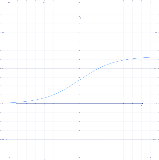

===================
Forward Propagation
===================

:題名: Deep Learning(Neural Network)における Forward propagation(順伝搬)の解説
:著者: 柏木 明博
:作成日: 2017年5月16日

神経細胞の数理モデル
====================

動物の神経細胞を調べ、その性質を数理モデルとしたものが、Forward propagation
（順伝搬）です。Forward propagationは、Neural Networkの基本的な仕組みとなっ
ており、どの学習方式でも用いられる計算方法です。

.. math::
	:label: 神経細胞モデル式

	z=\left \{ \sum_{i}^{N}w_{ij}\cdot x_{i} \right \}+b_{j}

	x:入力値

	z:出力値

	b:バイアス　

	w:結合荷重　

	i:入力ユニット番号

	j:出力ユニット番号

	N:入力ユニット数

これは、一般的な総和の式ですが、入力される信号 :math:`x` に荷重 :math:`w` を
掛けて、その総計をとり、バイアスを足すというものです。プログラミング言語(C言
語)で表すと、このようになります。

.. code-block:: c

        z = 0;

        for( i_cnt = 0; i_cnt < N; i_cnt++ ){

        	z += w[i_cnt][j_cnt] * x[i_cnt];
        }

        z += b[j_cnt];

プログラムで表すと、さほどの事はなく、単に集計しているだけなのがよく分かります。
神経細胞を模式的に表すと、下記のようになります。左の図は、実際の神経細胞、右の
図は、その数理モデルの模式図です。つまり、複数の入力を受取り、一つの出力を次の
神経細胞に渡す生きたデバイスです。

.. figure:: neuron_model.png
	:alt: 神経細胞とモデル
	:align: center

	図1.神経細胞とモデル

この図を例に説明すると、前の神経細胞からの入力値 :math:`x_1` 〜 :math:`x_3` に、
それぞれの結合荷重 :math:`w_1` 〜 :math:`w_3` を掛けた値を合計し、それにバイア
スを加えます。次の神経細胞へ信号を伝達するには一定の条件があり、この総和がある
値（閾値 :math:`θ` ）を超えると出力 :math:`z` が :math:`1` となります。この総和
を :math:`u` とすると、出力 :math:`z` は以下の関数 :math:`z=f(u)` となります。

.. math::
	:label: 閾値による出力値

	f(u) =\begin{cases}1 & u >=  \theta \\0 & u < \theta \end{cases}

	θ:閾値

Neural Networkにおける「学習」処理とは、目的の出力が得られるように、結合荷重 
:math:`w` をさまざまに変化させる処理を指します。この結合荷重を変化させることで、
入力に対する出力を変化・決定させることができます。

神経細胞の組合せで、動物は情報処理を行っているわけですが、この一つの方式のデバ
イスで、現在のノイマン型コンピュータを構成しているディジタル回路（論理積・論理
和・排他的論理和等）をすべて表すことができます。つまり、動物の神経細胞でいま私
達が利用しているコンピュータを作成することができます。コンピュータにできること
は、動物の脳でも可能なのです。

活性化関数
==========

活性化関数は、細胞やたんぱく質の反応をモデル化したものですが、Neural Networkで
は出力値 :math:`z` を実際の神経細胞の出力と考えられる形に近づけるために用いられ
ます。一般に、ミカエリス・メンテン式によく似た非線形関数であるシグモイド関数や
tanh関数、また出力が線形になる正規化線形関数などがあります。今回は、活性化関数
の基本として受け入れられているシグモイド関数を用いています。

.. math::
	:label: シグモイド関数

	f(x) = \frac{1}{1+ e^{- \alpha x} }

	x:入力

	e:自然対数

	α:定数

シグモイド関数は、非線形の関数であり、入力の値域を :math:`-∞` 〜 :math:`+∞` に
取る、出力 :math:`0` 〜 :math:`1` の関数です。出力は下記のようになります。シグ
モイドとは、アルファベットのSの意味です。

	図2.シグモイド曲線

注意しなければいけないのは、入力の値域が無限大とはいえ、その可変域は限られる点
です。大きすぎる値や小さすぎる値を入力しても、 :math:`1` または :math:`0` の出
力しか得られなくなります。定数 :math:`α` によってシグモイド曲線の形を変えること
が出来るため、入力値の最大・最小値に合わせて :math:`α` を変更するか、入力値を正
規化するなどして調整します。

論理積と論理和による実際の計算例
================================

論理積と論理和の計算を例に、実際にForward Propagation(順伝搬)を計算してみます。
論理積の入力と出力(真理値表)は、以下の通りです。

.. csv-table:: 論理積(AND)
	:header: ""," :math:`x_1` "," :math:`x_2` "," :math:`z` "
	:widths: 10, 10, 10, 10
	:stub-columns: 1

	"入力1:", 0,   0,    0
	"入力2:", 0,   1,    0
	"入力3:", 1,   0,    0
	"入力4:", 1,   1,    1

そして、結合荷重 :math:`w_1=0.53` と :math:`w_2=0.33`、閾値 :math:`θ=0.7` とす
ると、式1と式2を上記の表のそれぞれの値について計算した結果は、以下のようになり
ます。

.. csv-table:: 論理積(AND)の計算結果
	:header: "","式1:( :math:`x_1 w_1)+(x_2 w_2)`","式2:閾値との関係"," :math:`z` "
	:widths: 10, 10, 10, 10
	:stub-columns: 1

	"入力1:", :math:`(0*0.53)+(0*0.33)=0.00` , :math:`< 0.7` , :math:`0`
	"入力2:", :math:`(0*0.53)+(1*0.33)=0.33` , :math:`< 0.7` , :math:`0`
	"入力3:", :math:`(1*0.53)+(0*0.33)=0.53` , :math:`< 0.7` , :math:`0`
	"入力4:", :math:`(1*0.53)+(1*0.33)=0.86` , :math:`> 0.7` , :math:`1`

閾値 :math:`θ` 以下の場合は :math:`z=0` 、閾値 :math:`θ` 以上の場合は :math:`z=1` 
となります。また、論理和の入力と出力(真理値表)は、以下の通りです。

.. csv-table:: 論理和(OR)
	:header: ""," :math:`x_1` "," :math:`x_2` "," :math:`z` "
	:widths: 10, 10, 10, 10
	:stub-columns: 1

	"入力1:", 0,   0,    0
	"入力2:", 0,   1,    1
	"入力3:", 1,   0,    1
	"入力4:", 1,   1,    1

同じように、結合荷重 :math:`w_1=0.85` と :math:`w_2=0.85` 、閾値 :math:`θ=0.7`
とすると、式1と式2を上記の表のそれぞれの値について計算した結果は、以下のように
なります。

.. csv-table:: 論理和(OR)の計算結果
	:header: "","式1:( :math:`x_1 w_1)+(x_2 w_2)`","式2:閾値との関係"," :math:`z` "
	:widths: 10, 10, 10, 10
	:stub-columns: 1

	"入力1:", :math:`(0*0.85)+(0*0.85)=0.00` , :math:`< 0.7` , :math:`0`
	"入力2:", :math:`(0*0.85)+(1*0.85)=0.85` , :math:`> 0.7` , :math:`1`
	"入力3:", :math:`(1*0.85)+(0*0.85)=0.85` , :math:`> 0.7` , :math:`1`
	"入力4:", :math:`(1*0.85)+(1*0.85)=1.70` , :math:`> 0.7` , :math:`1`

このように、結合荷重を適切に決めることによって、Neural Networkはさまざまな出力を
得ることができます。この計算例では、シグモイド関数(式3)は省略しましたが、上記の
閾値と比較する前の計算結果に関数を適用することで、求めることができます。

Forward Propagation(順伝搬)の実際の関数については、最後の項目「結果(Result)」で
も解説していますので、順次読み進めて行くか、先に参照しても構いません。
